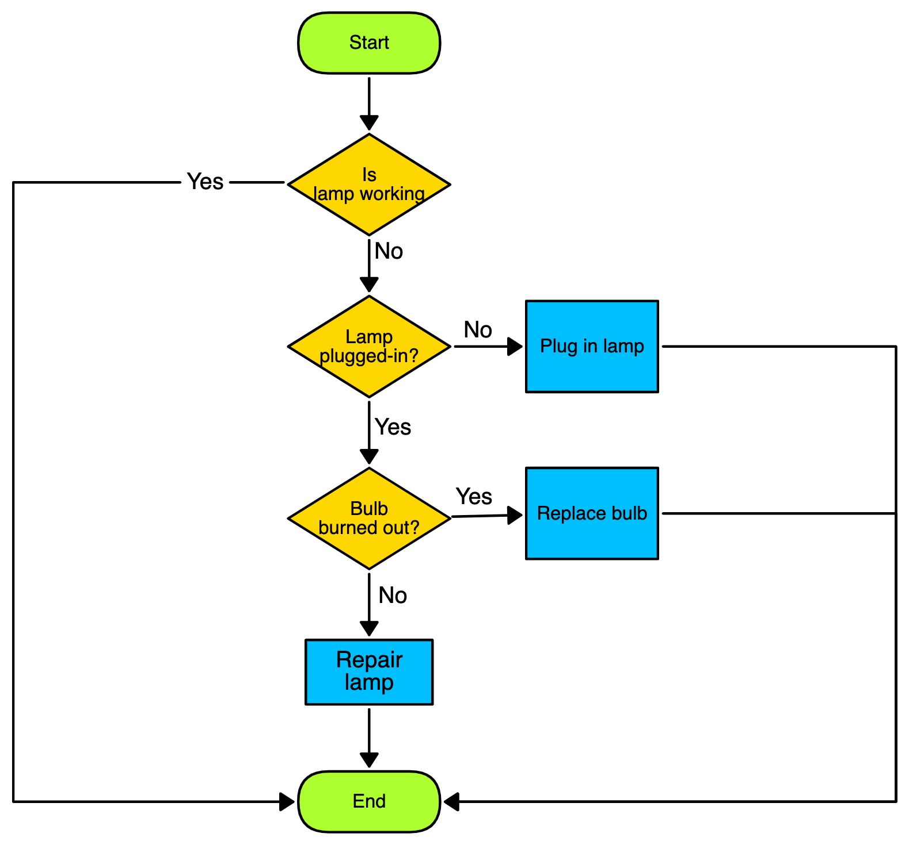

# 9CT Assessment Task 1
### By Montgomery Burns

## Requirements Outline
### Functional Requirements
+ First requirement
+ Second
    + Sub 2
    + Sub 2
        + Sub sub 2

### Non-Functional Requirements
My **_non-functional_** requirements are...

## Design
### Pseudocode
```
BEGIN
    INPUT thing
    IF thing THEN 


```
### Flowcharts



## Development and Integration
```Python
print('This is my code for thing')
```
